# Fifth_Class

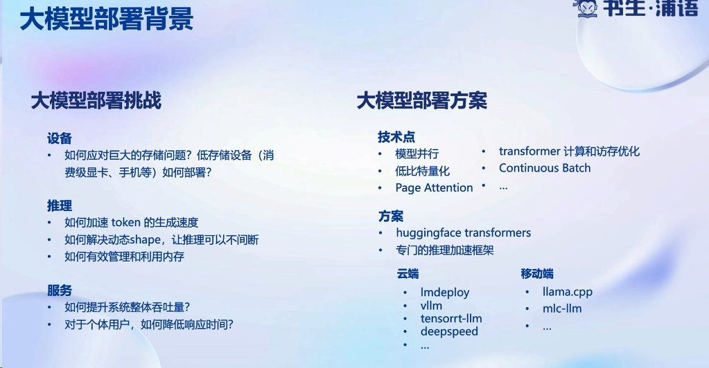

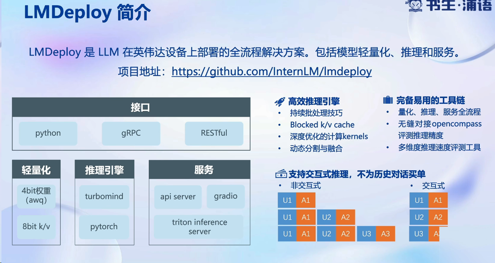

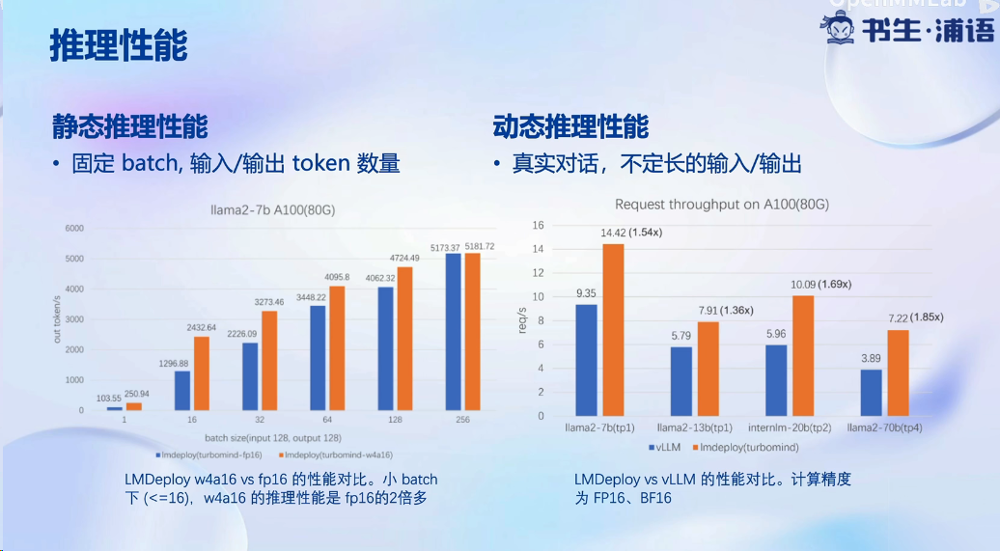

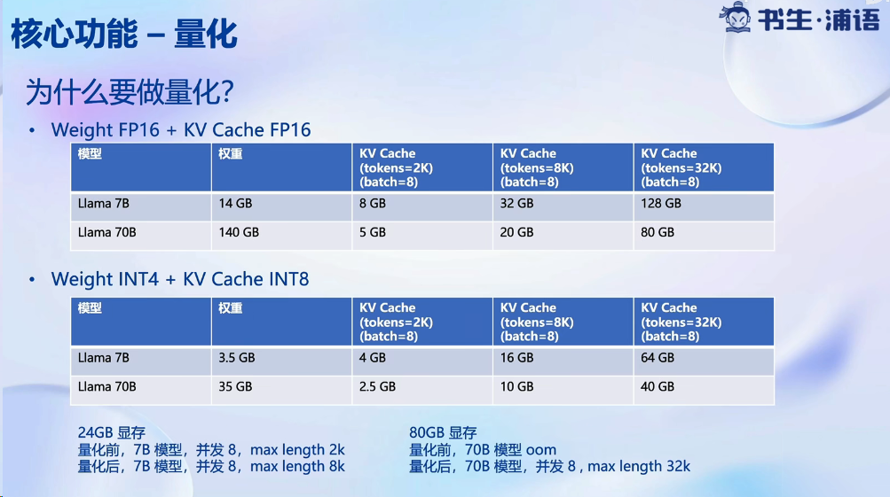

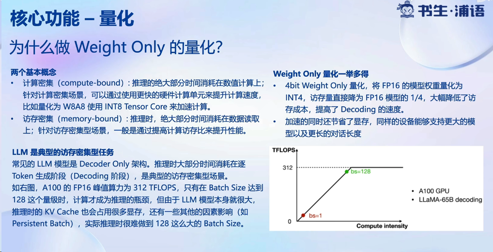

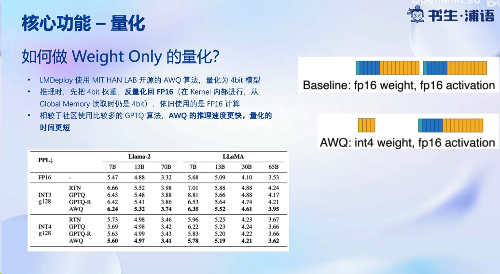

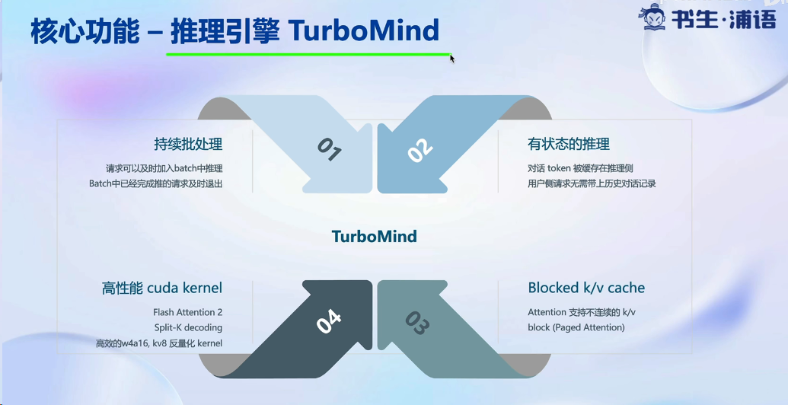

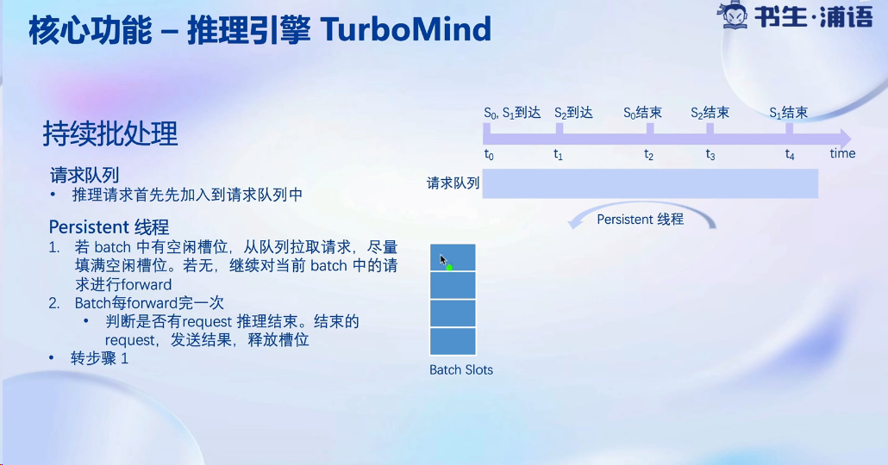

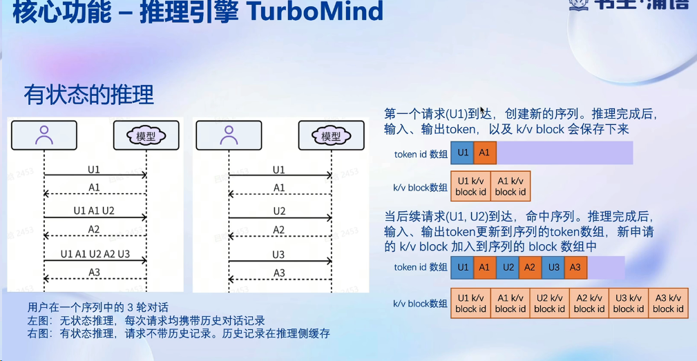

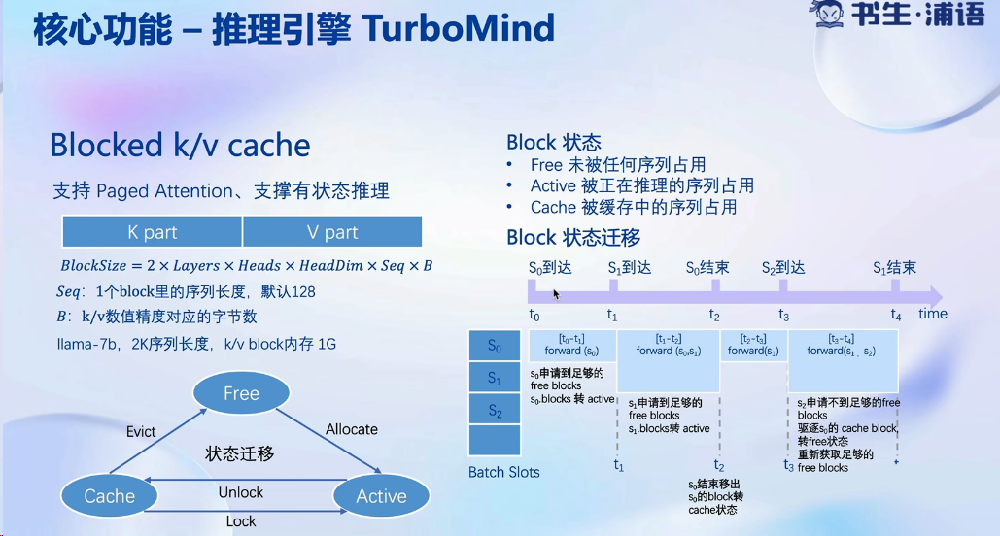

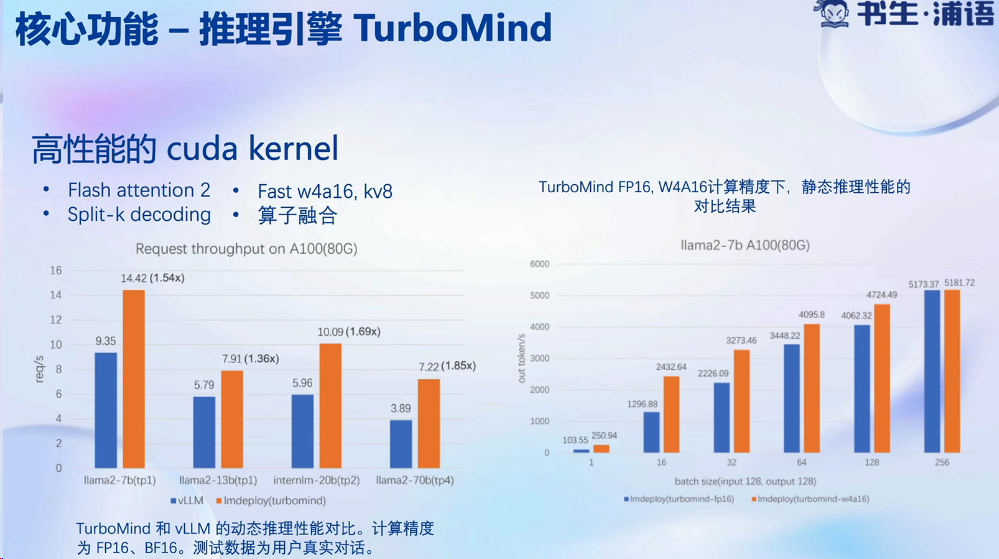

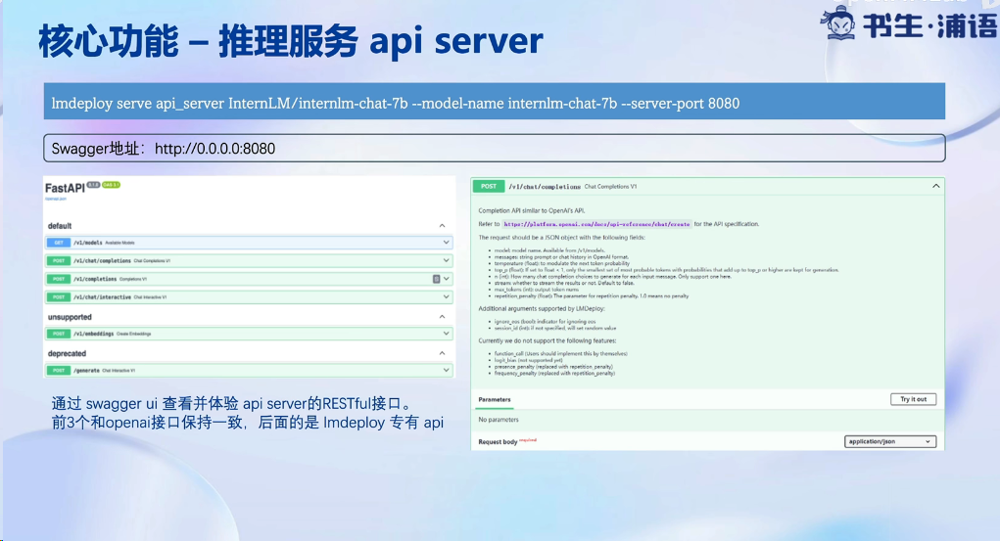

 

**基础作业：**

- 使用 LMDeploy 以本地对话、网页Gradio、API服务中的一种方式部署 InternLM-Chat-7B 模型，生成 300 字的小故事（需截图）

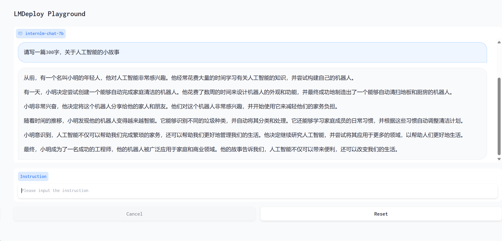

**进阶作业（可选做）**

- 将第四节课训练自我认知小助手模型使用 LMDeploy 量化部署到 OpenXLab 平台。
- 对internlm-chat-7b模型进行量化，并同时使用KV Cache量化，使用量化后的模型完成API服务的部署，分别对比模型量化前后和 KV Cache 量化前后的显存大小（将 bs设置为 1 和 max len 设置为512）。
- 在自己的任务数据集上任取若干条进行Benchmark测试，测试方向包括：
  （1）TurboMind推理+Python代码集成
  （2）在（1）的基础上采用W4A16量化
  （3）在（1）的基础上开启KV Cache量化
  （4）在（2）的基础上开启KV Cache量化
  （5）使用Huggingface推理

进阶部分只完成了KV Cache量化和W4A16量化，

原始部署的情况下，不使用KVcache和W4A16，其显存占用为14886MB

在开启KVcache后，显存占用为14758MB，需要注意的是要将config中quant_policy改为4，只开启KVcache显存下降幅度不大。

W4A16量化显存占用仅为5984MB

W4A16量化+KVcache显存占用仅为5856MB

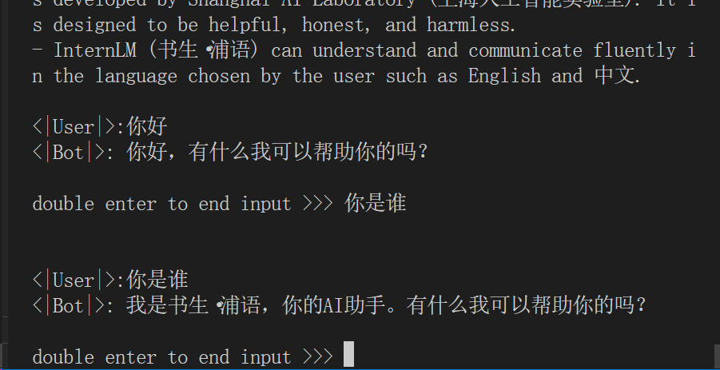

