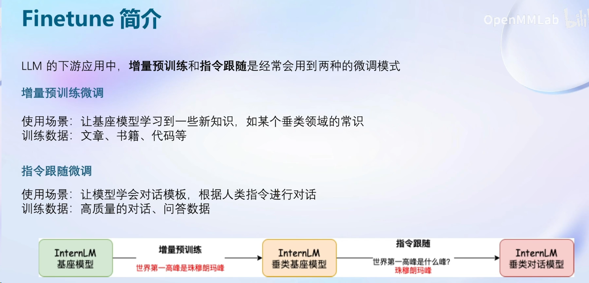
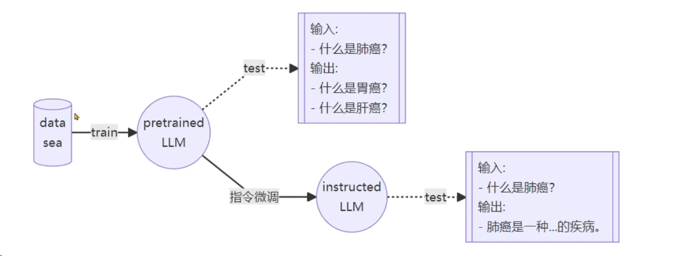
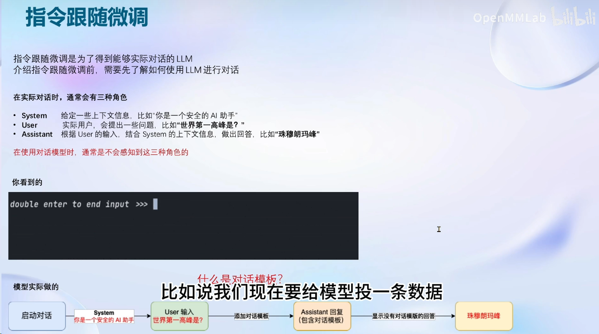
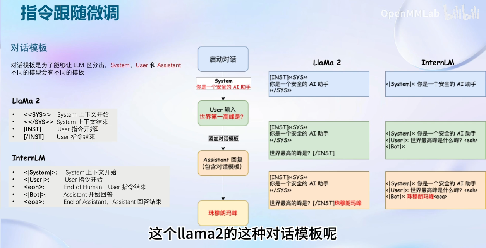
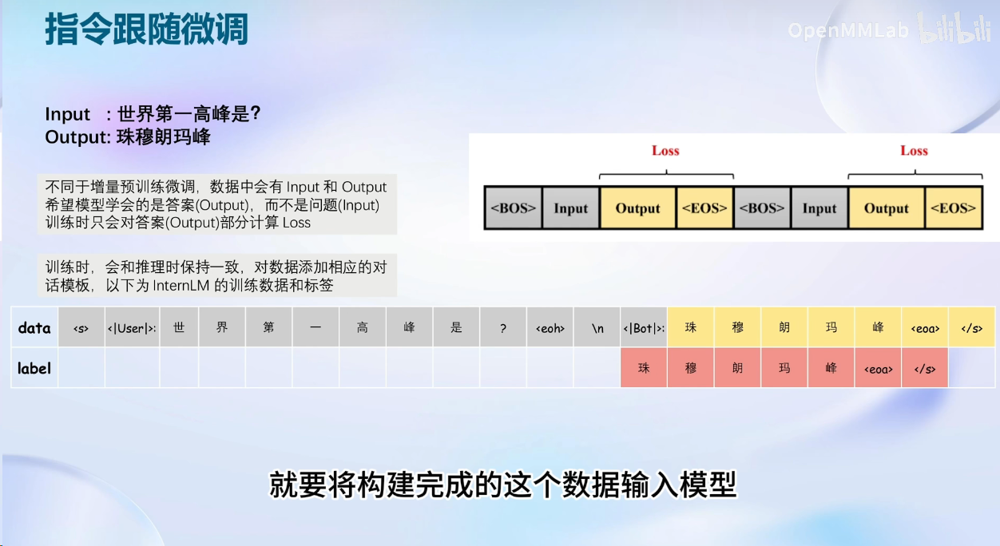
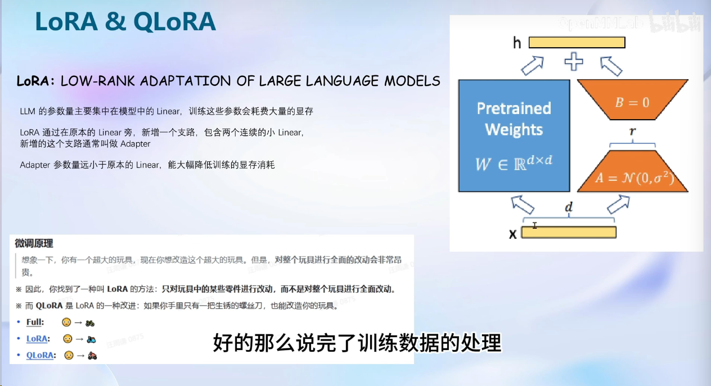
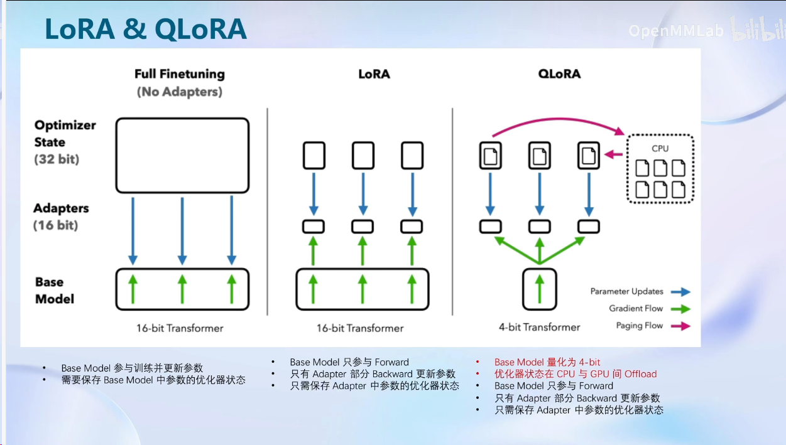
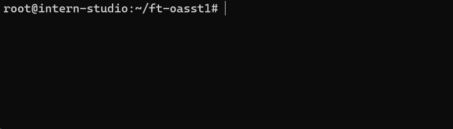
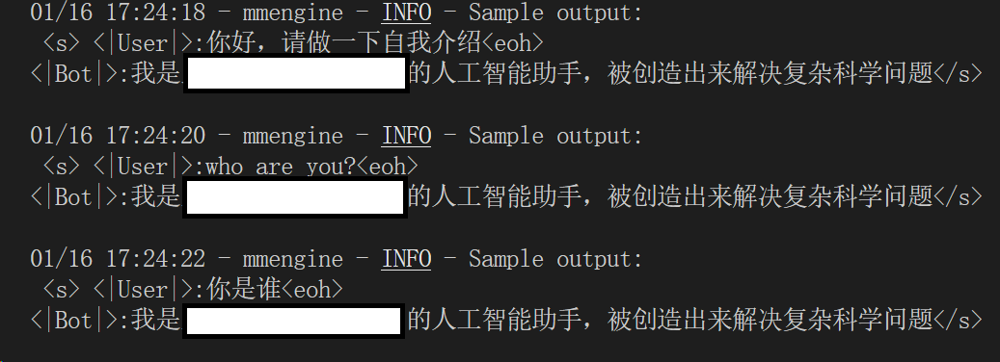

# Fourth_Class

Finetune简介

常用两种微调模式：**增量预训练和指令跟随**

防止ssh中断导致的训练失败：

apt update -y
更新apt

apt install tmux -y

tmux new -s finetune

随后就可以在tmux的session中进行训练ctril + b +d，可以回到bash终端

tmux attach -t finetune,可以再回去

因此可以让tmux跑的可以一直跑，本地的ssh可以关掉

关闭所有session：

tmux kill-server

关闭指定：

tmux kill-session -t <session-name>

**基础作业：**

构建数据集，使用 XTuner 微调 InternLM-Chat-7B 模型, 让模型学习到它是你的智能小助手，效果如下图所示，本作业训练出来的模型的输出需要**将不要葱姜蒜大佬**替换成自己名字或昵称！

经过训练，发现bs为2，max_length512，训练300代时已基本训练完成，能够回答问题。

**进阶作业：**

- 将训练好的Adapter模型权重上传到 OpenXLab、Hugging Face 或者 MoelScope 任一一平台。
- 将训练好后的模型应用部署到 OpenXLab 平台，参考部署文档请访问：https://aicarrier.feishu.cn/docx/MQH6dygcKolG37x0ekcc4oZhnCe

未完成

