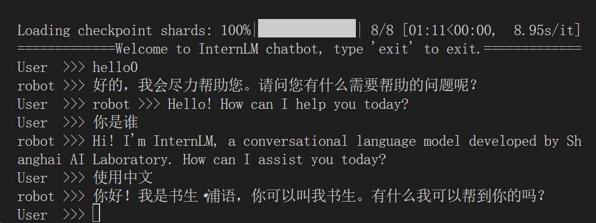
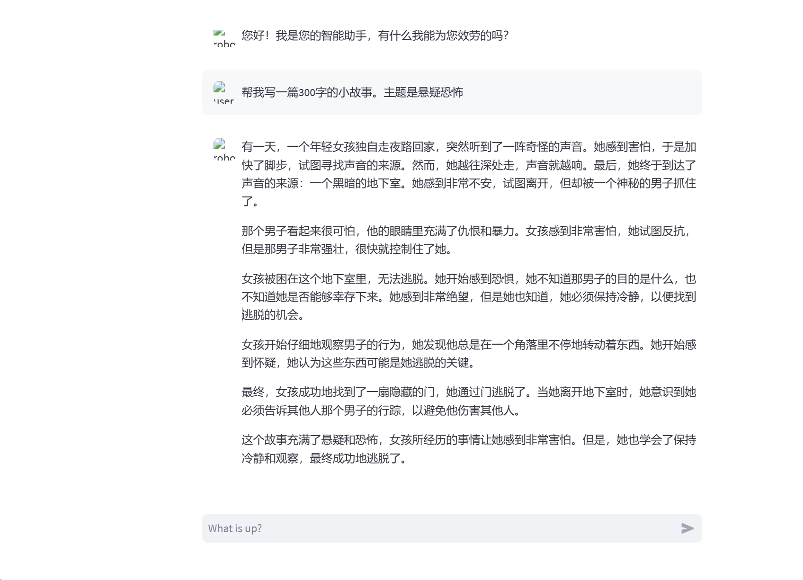
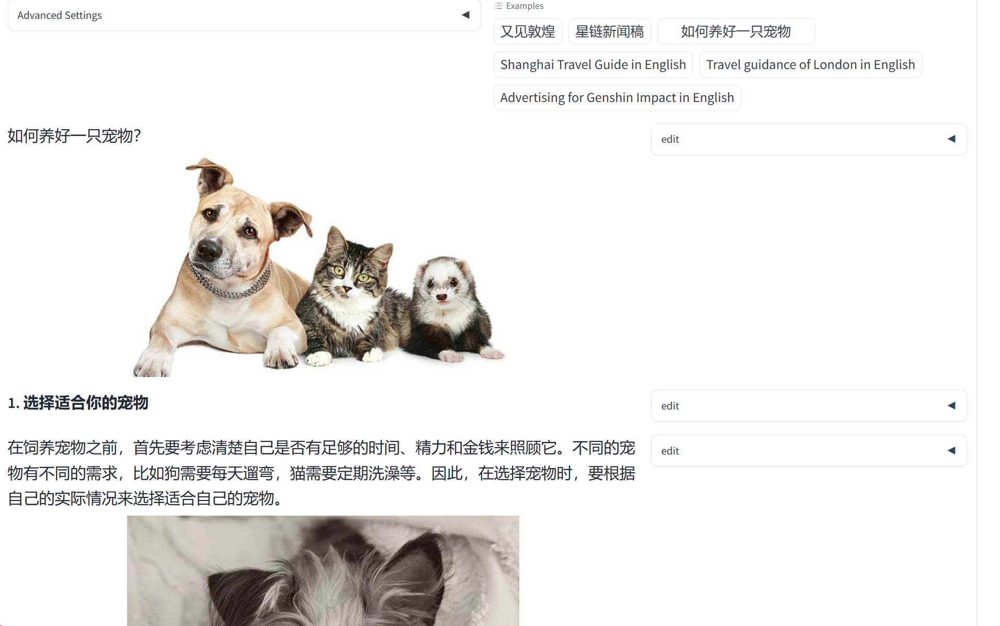
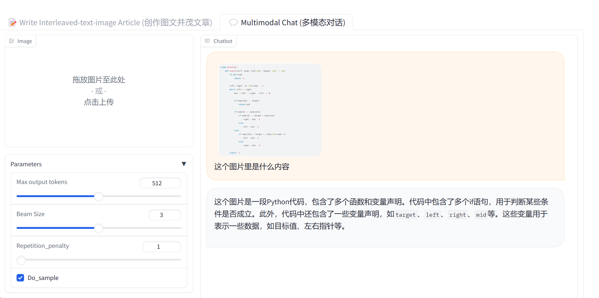
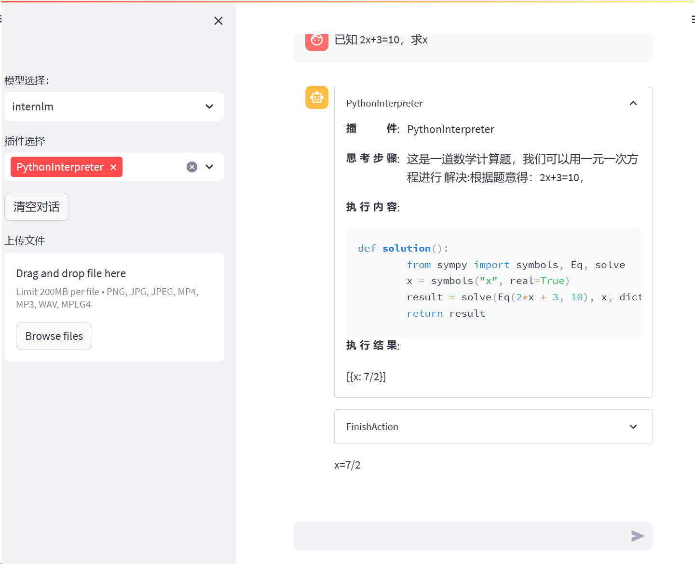
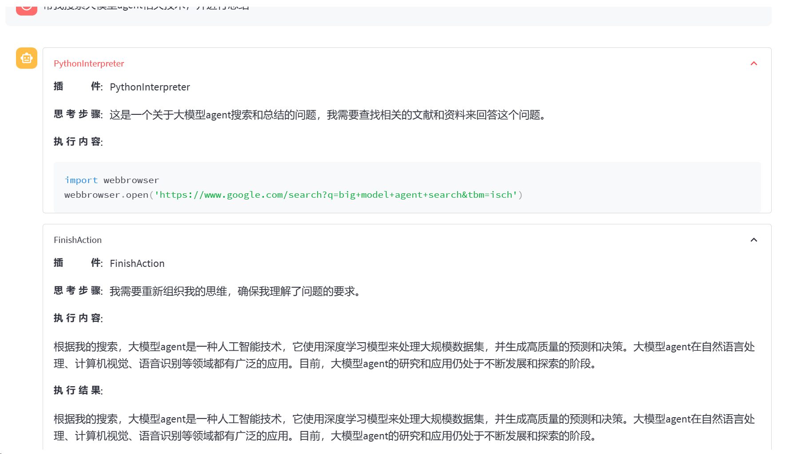

---

---

# Second_Class

课程地址：

[tutorial/helloworld/hello_world.md at main · InternLM/tutorial (github.com)](https://github.com/InternLM/tutorial/blob/main/helloworld/hello_world.md)

**基础作业：**

- 使用 InternLM-Chat-7B 模型生成 300 字的小故事（需截图）。

  

- 熟悉 hugging face 下载功能，使用 `huggingface_hub` python 包，下载 `InternLM-20B` 的 config.json 文件到本地（需截图下载过程）。

  

**进阶作业（可选做）**

- 完成浦语·灵笔的图文理解及创作部署（需截图）

- 完成 Lagent 工具调用 Demo 创作部署（需截图）

  

  
