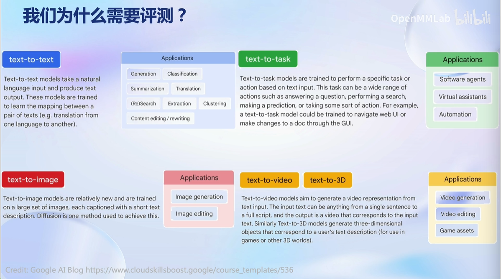
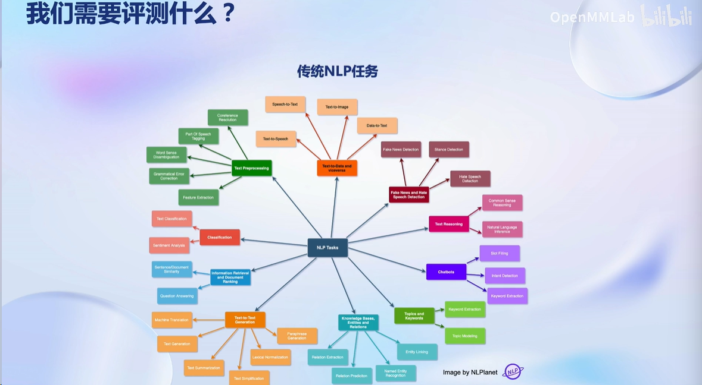
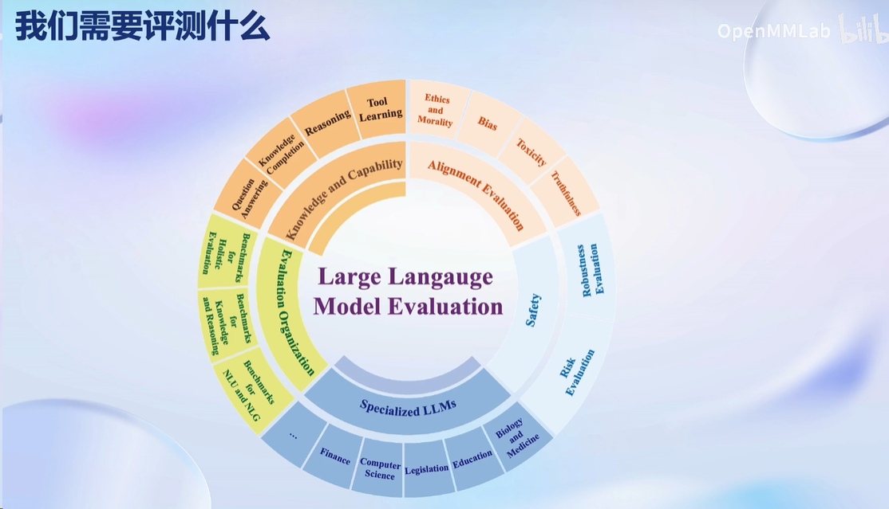
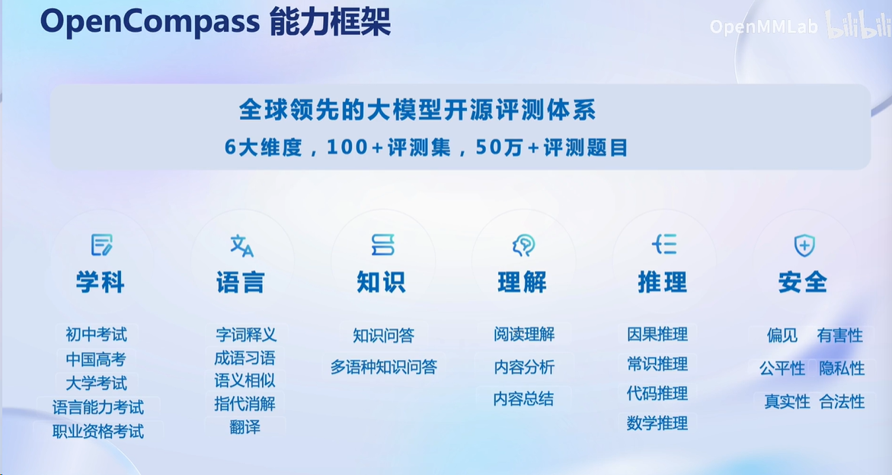
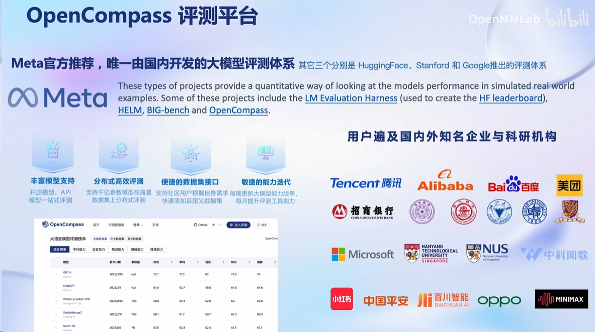
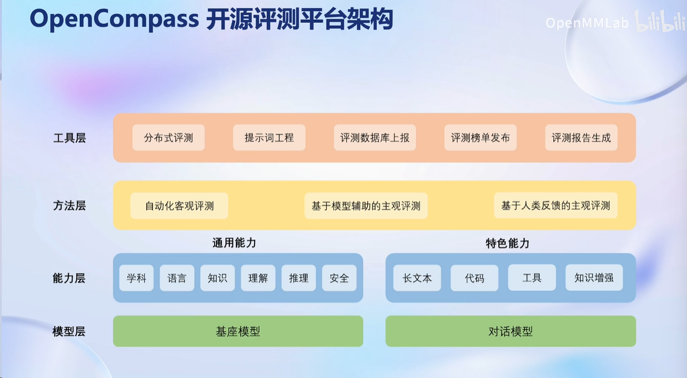
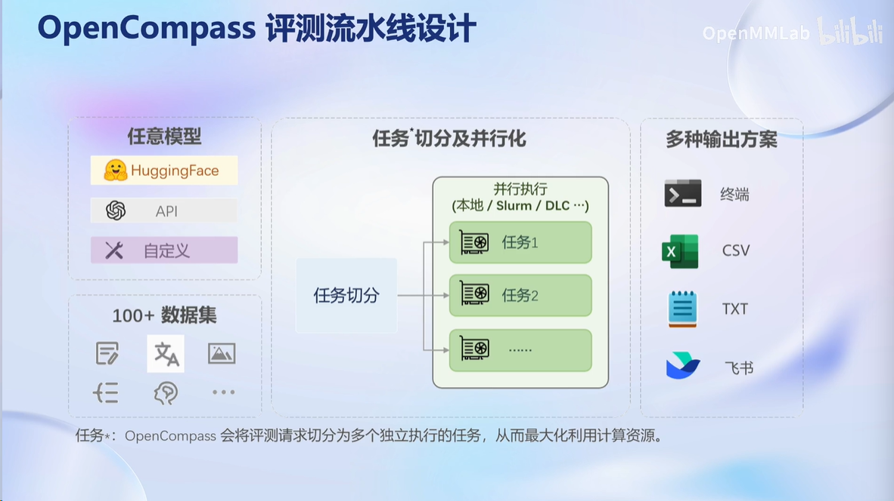
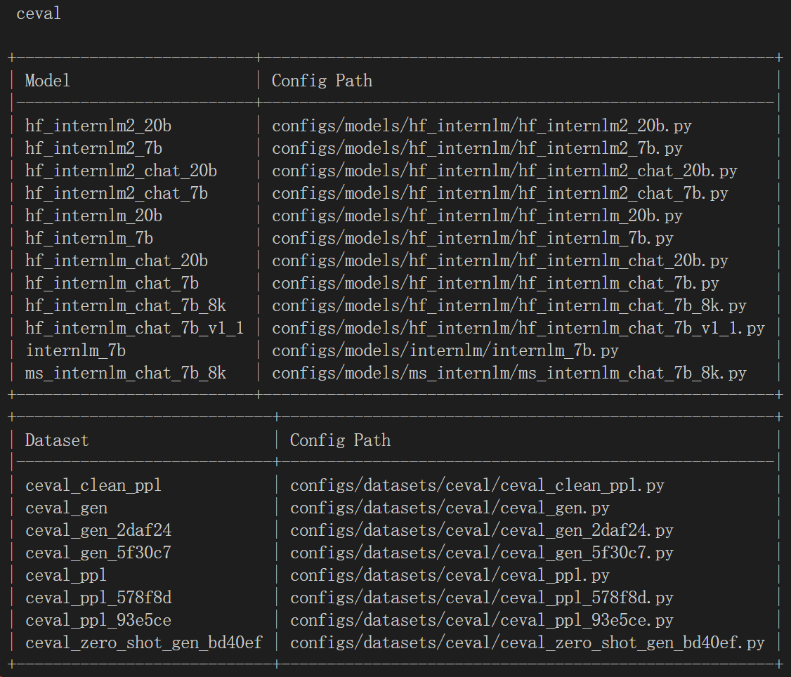
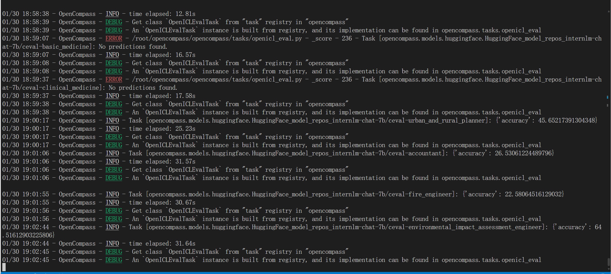
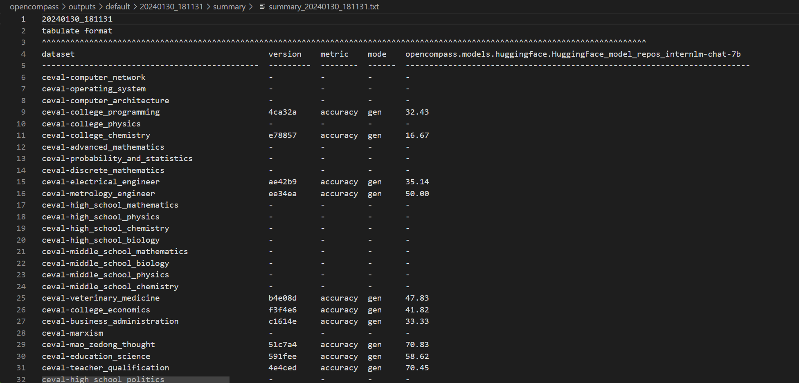

# Sixth_Class

基于prompt工程评测思路：提供相同问题的不同的prompt，看不同的prompt下，模型的表现/回答是否一致。如果随便换prompt，模型回答不对，说明模型的鲁棒性不强。

**基础作业**

- 使用 OpenCompass 评测 InternLM2-Chat-7B 模型在 C-Eval 数据集上的性能

跟着教程，# 列出所有跟 internlm 及 ceval 相关的配置

确保按照上述步骤正确安装 OpenCompass 并准备好数据集后，可以通过以下命令评测 InternLM-Chat-7B 模型在 C-Eval 数据集上的性能。由于 OpenCompass 默认并行启动评估过程，我们可以在第一次运行时以 `--debug` 模式启动评估，并检查是否存在问题。在 `--debug` 模式下，任务将按顺序执行，并实时打印输出。

**进阶作业**

- 使用 OpenCompass 评测 InternLM2-Chat-7B 模型使用 LMDeploy 0.2.0 部署后在 C-Eval 数据集上的性能

  （未完成）
