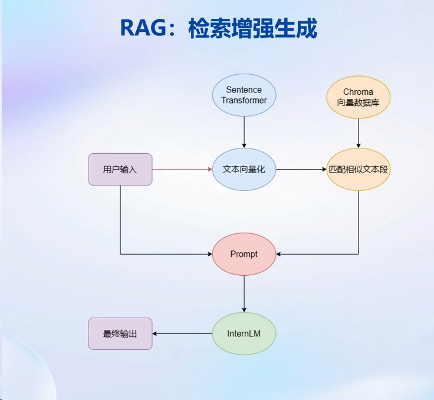
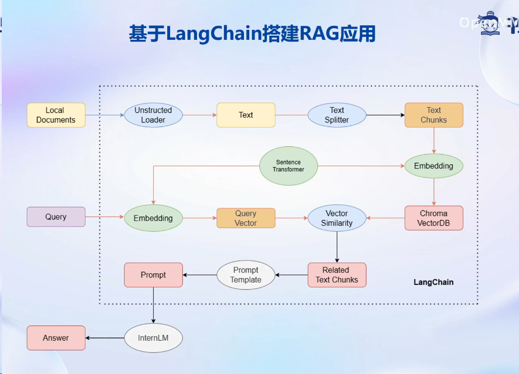
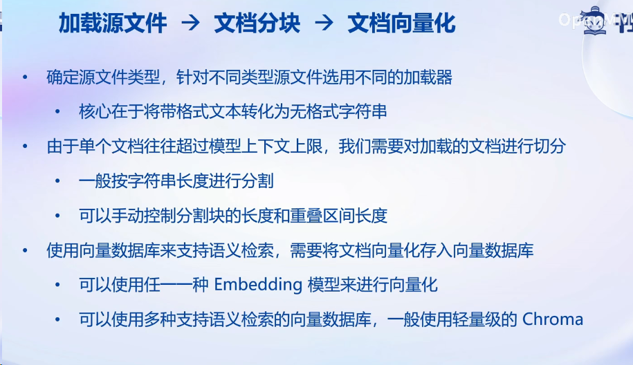
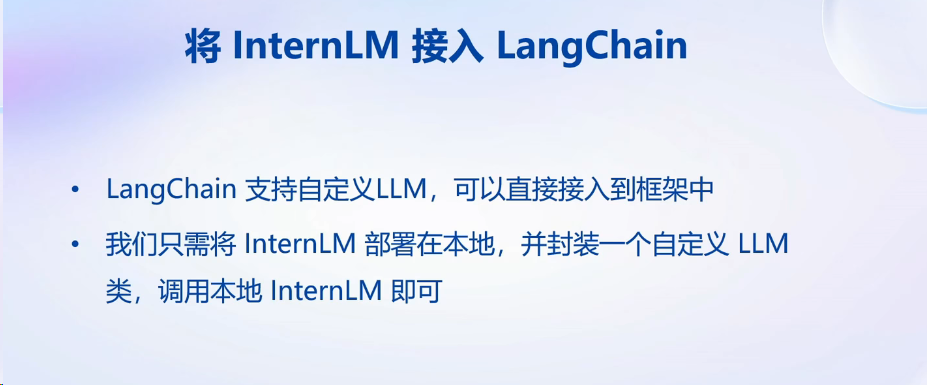
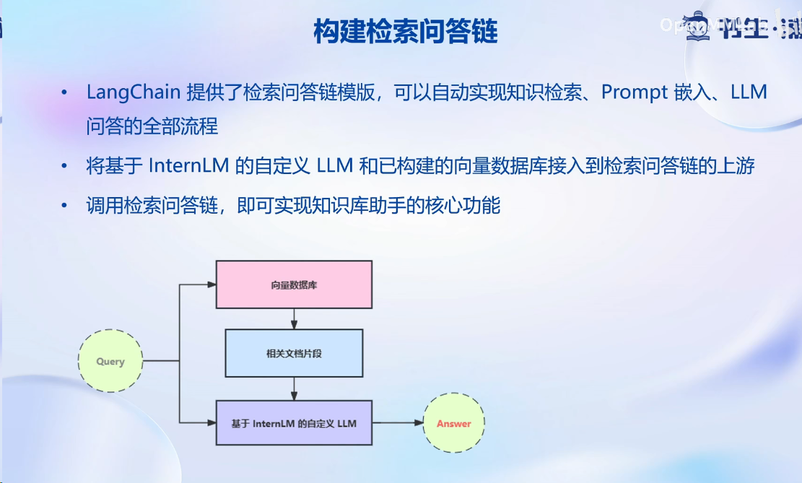
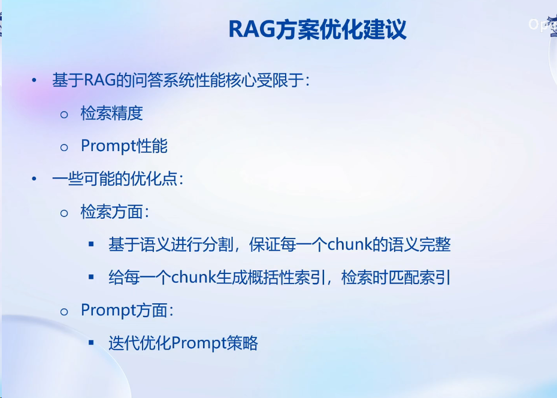
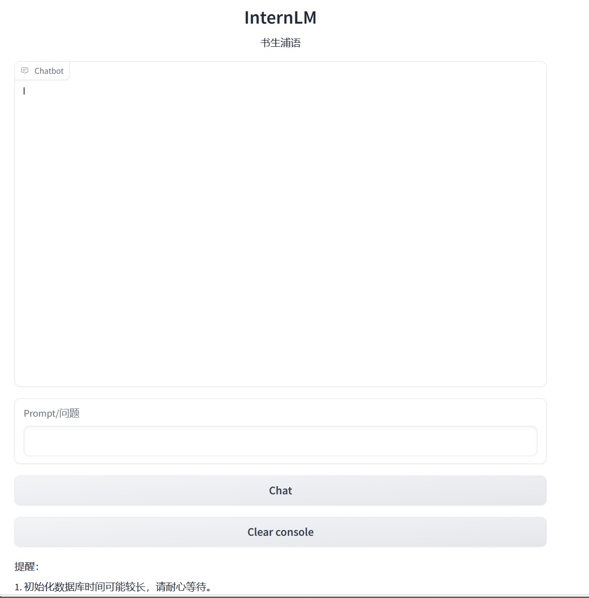
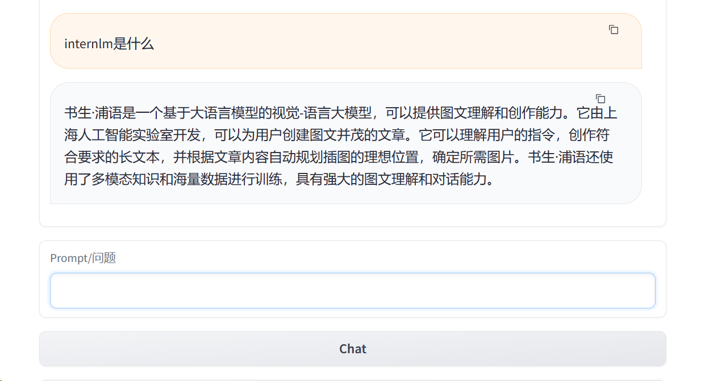

# Third_Class

大模型的两种开发范式：**RAG和finetune**

大模型**局限性**：

- 知识时效性受限:如何让LLM能够获取最新的知识
- 专业能力有限: 如何打造垂域大模型
- 定制化成本高:如何打造个人专属的LLM应用

**RAG**

- 低成本
- 可实时更新
- 受基座模型影响大
- 单次回答知识有限

**Finetune**

- 可个性化微调
- 知识覆盖面广
- 成本高昂
- 无法实时更新

**LangChain开源工具**

LangChain 框架是一个开源工具，通过为各种 LLM 提供通用接口来简化应用程序的开发流程，帮助开发者自由构建 LLM应用

LangChain 的核心组成模块:

链 (Chains) : 将组件组合实现端到端应用，通过一个对象封装实现一系列LLM 操作

Eg.检索问答链，覆盖实现了 RAG (检索增强生成)的全部流程

搭建知识库助手

简易web部署框架：gradio、streamlit

相关链接：[tutorial/langchain/readme.md at main · InternLM/tutorial (github.com)](https://github.com/InternLM/tutorial/blob/main/langchain/readme.md)

[prompt-engineering-for-developers/content/LangChain Chat with Your Data/1.简介 Introduction.md at 9dbcb48416eb8af9ff9447388838521dc0f9acb0 · datawhalechina/prompt-engineering-for-developers (github.com)](https://github.com/datawhalechina/prompt-engineering-for-developers/blob/9dbcb48416eb8af9ff9447388838521dc0f9acb0/content/LangChain Chat with Your Data/1.简介 Introduction.md)

**基础作业**：

复现课程知识库助手搭建过程 (截图)

知识库助手的搭建过程可以参考视频和文档，实现起来没有什么阻碍，这里只贴出实现结果。

**进阶作业**：

选择一个垂直领域，收集该领域的专业资料构建专业知识库，并搭建专业问答助手，并在 [OpenXLab](https://openxlab.org.cn/apps) 上成功部署（截图，并提供应用地址）

（未实现）

